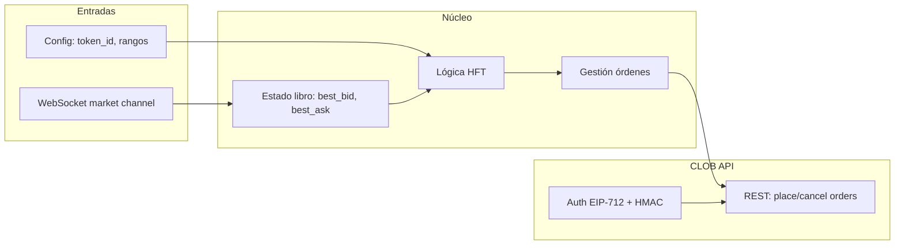

# Bot HFT en Rust para Polymarket (mercado 5 min BTC)

## Contexto

- **Workspace:** vacío; se creará el proyecto desde cero.
- **Polymarket:** CLOB con REST + WebSocket; SDK oficial en Rust: [polymarket-client-sdk](https://docs.rs/polymarket-client-sdk) (features `clob`, `ws`; opcional `gamma` para descubrir mercados).
- **Mercado 5 min BTC:** en Polymarket son mercados de predicción (ej. “BTC above $X in 5 minutes”). Cada mercado tiene un `condition_id` y dos **token_id** (outcomes Yes/No). El bot operará sobre **un** token_id (configurable).

## Lógica de trading

| Condición           | Acción                                                                                                                                                       |
| ------------------- | ------------------------------------------------------------------------------------------------------------------------------------------------------------ |
| **Best bid ≥ 0.97** | Take profit: vender con **limit = best_bid** (uniforme; más fill-friendly y objetivo ya cumplido).                                                           |
| **Best bid ≤ 0.90** | Stop loss: vender con **limit = best_bid** (FAK; si fill parcial, **reintentar de inmediato** el remanente; dedupe permite “size cambió” → nueva intención). |
| **Rango 0.93–0.95** | **Una sola orden de compra viva** en ese rango; si libro **stale** → no colocar/comprar (bloquear compras).                                                  |

**Regla de precio SL/TP uniforme:** en ambos casos **limit = best_bid** (siempre cruzando). Para TP, si best_bid ≥ 0.97, vender a best_bid es más fill-friendly y no pierde el objetivo (ya estás por encima de 0.97). No usar `min(0.97, best_bid)`; dejar uniforme: SL y TP → `limit_price = best_bid`.

**SL con FAK parcial:** si la venta SL (FAK) se ejecuta solo en parte, reintentar **inmediatamente** el resto (remanente). El dedupe debe permitir “size cambió” → nueva intención: la clave de dedupe para SellSL (y SellTP si aplica) incluye el **size**; si el size a vender cambia (remanente), no se considera la misma intención y se puede enviar de nuevo dentro del TTL.

**Fill parcial — definición y detección**

- **Definición:** fill parcial = la orden SL (FAK) se ejecutó solo en parte: `filled_size > 0` y `filled_size < size` enviado. El **remanente** es `size - filled_size`; ese es el size con el que se hace el retry inmediato.
- **Detección (prioridad):**
  1. **Si hay fills por WebSocket** (canal de user orders/trades, p. ej. `subscribe_orders` / eventos de fill): usar el evento WS para saber cuánto se llenó y actualizar posición; si en el mismo tick o en el callback vemos fill parcial para esa orden SL, disparar retry con remanente.
  2. **Si no hay fills por WS:** usar **la respuesta REST** de `post_order`: leer `**filled_size`** y `**status`** del cuerpo de la respuesta. Si la API devuelve `filled_size` y `status` (p. ej. “partially_filled” o equivalente), considerar fill parcial cuando `0 < filled_size < order_size` → actualizar posición local con `filled_size`, calcular remanente = `order_size - filled_size` y **disparar el retry inmediato** en el mismo flujo (antes de pasar al siguiente evento). No esperar al siguiente tick del WS para el retry; hacerlo justo después de procesar la respuesta de la orden SL.

**Early return por tick (SL > TP > resto):** en cada tick del libro, **no hacer más de una cosa**. Orden de prioridad: **SL > TP > resto** (compras / gestión de orden de compra). Si en este tick se **envía SL** → **early return**: no evaluar TP ni compras en el mismo tick. Si se **envía TP** → early return: no evaluar compras en el mismo tick. Solo si no se envió ni SL ni TP, evaluar compras. Esto reduce jitter y evita múltiples órdenes en el mismo tick.

### Reglas de implementación (resumen)

- **SL/TP:** regla uniforme — **limit = best_bid** (ambos; no min(0.97, best_bid) en TP).
- **SL reintento por remanente:** si SL vende con FAK y hay fill parcial, reintentar de inmediato el resto; dedupe con **size en la intención** (“size cambió” → nueva intención, permitir retry). **Fill parcial:** definido como `0 < filled_size < order_size`; detectar por WS user fills si existe, si no por **respuesta REST** (`filled_size` / `status`) de la orden para disparar retry en el mismo flujo.
- **Early return por tick:** SL > TP > resto; si se manda SL (o TP) en este tick, no hacer nada más en el mismo tick (early return).
- **Dedupe por intención:** TTL 20–80 ms; intención incluye tipo (Buy / SellTP / SellSL) y para ventas **size** (distinto size = no dedupe).
- **Posición:** fuente primaria = posición local (expected); refresh REST solo en eventos clave (place/cancel, reconexión, fill).
- **Compras:** 1 sola orden de compra viva en el rango 0.93–0.95; **bloquear compras si libro stale**.
- **Stale-book gate:** umbral **agresivo para 5-min BTC:** `stale_threshold_ms` en **100–250 ms** para SL/TP; si stale y hay que ejecutar SL/TP → fallback REST (GET /book) y luego enviar. Compras: si libro stale, no colocar orden.

## Arquitectura propuesta

- **Una sola tarea async:** un loop que recibe eventos del WebSocket y, en el mismo proceso, decide y envía órdenes por REST (sin colas innecesarias para minimizar latencia).
- **WebSocket:** suscripción al canal `market` con `assets_ids: [token_id]` y `custom_feature_enabled: true` para eventos `best_bid_ask` y `book`. Actualizar estado local de best bid/ask en cada evento; registrar timestamp **monotónico** del último update para stale-book gate.
- **REST:** cliente CLOB autenticado (Builder auth con clave privada) para `post_order`, `cancel_order`, `GET /book` (solo fallback para SL/TP cuando libro esté stale) y refresh de posición solo en eventos clave.
- **Posición:** fuente primaria = **posición local (expected)** derivada de nuestras órdenes y fills; refresh vía REST **solo en eventos clave** (tras place/cancel, reconexión WS, o evento de fill si se suscribe).
- **Una sola orden de compra viva:** en el rango 0.93–0.95 solo se mantiene **1** orden limit de compra activa; se cancela/recoloca según estrategia, no 3 niveles fijos.

## Stack técnico

- **Rust:** proyecto con `cargo init` (binario).
- **Dependencias (Cargo.toml):**
  - `polymarket-client-sdk = { version = "0.4", features = ["clob", "ws"] }` — CLOB + WebSocket.
  - Opcional: `features = ["gamma"]` si se quiere descubrir el mercado por slug/búsqueda (ej. “BTC 5min”).
  - `tokio = { version = "1", features = ["full"] }` — runtime async.
  - `anyhow`, `tracing` (y opcionalmente `tracing-subscriber`) para errores y logs.
- **MSRV:** Rust 1.88 (según SDK).

## Configuración

- **Variables de entorno:**
  - `POLYMARKET_PRIVATE_KEY` — obligatoria para firmar y operar.
  - Opcional: `POLYMARKET_CLOB_URL` (default `https://clob.polymarket.com`).
- **Parámetros del bot (config o CLI):**
  - `token_id` — ID del token (outcome) del mercado 5 min BTC.
  - `buy_min`, `buy_max` — 0.93 y 0.95.
  - `take_profit_price` — 0.97.
  - `stop_loss_price` — 0.90.
  - **Dedupe TTL:** 20–80 ms (ventana para no repetir la misma intención; ej. `dedupe_ttl_ms: 20` a 80).
  - **Stale-book threshold:** para 5-min BTC, umbral **agresivo**: **100–250 ms** para SL/TP; si el libro no se actualiza en ese tiempo y hay que ejecutar SL/TP, fallback REST. **Compras:** bloquear si libro stale (no colocar orden).
  - Tamaño por orden y/o tamaño máximo de posición.

El **token_id** del mercado de 5 min de BTC se puede obtener manualmente desde la UI de Polymarket (URL o DevTools) o, si se añade el feature `gamma`, buscando mercados por slug/título y leyendo el `token_id` del outcome deseado desde la API Gamma.

## Flujo del bot (pseudocódigo)

1. **Inicio:** cargar config, crear cliente CLOB autenticado, conectar WebSocket al `market` con `assets_ids: [token_id]`. Inicializar posición local (expected) opcionalmente con un REST refresh. Inicializar reloj monotónico para el libro y dedupe por intención (TTL 20–80 ms).
2. **Por cada evento (`book` o `best_bid_ask`):**
  - Actualizar `best_bid` y `best_ask` y **timestamp monotónico** del último update del libro.
  - **Early return por tick:** evaluar en orden **SL > TP > resto**. Si en este tick se envía SL o TP, **no hacer nada más** (no TP, no compras); salir del tick. Solo si no se envió ni SL ni TP, evaluar compras.
  - **Stale-book gate:** si debemos actuar en SL o TP y el libro no se ha actualizado en más de `stale_threshold_ms` (100–250 ms), hacer **GET /book** (REST) para obtener `best_bid` fresco; luego enviar la orden con **limit = best_bid**. Para **compras:** si el libro está stale, **no** colocar orden (bloquear hasta próximo update).
  - **Dedupe por intención:** antes de enviar cualquier orden, comprobar dedupe. La intención incluye **tipo** (Buy / SellTP / SellSL) y para ventas **size**; si el size a vender cambia (ej. remanente tras FAK parcial), cuenta como nueva intención y se puede enviar de inmediato. Misma intención (mismo tipo + size) dentro de `dedupe_ttl_ms` → no reenviar.
  - **Stop loss (máxima prioridad):** si `best_bid <= 0.90` y posición local > 0, enviar **venta limit** con **limit = best_bid** (FAK). Tras enviar, leer **respuesta REST**: si `0 < filled_size < size` → fill parcial → actualizar posición con `filled_size`, calcular remanente = `size - filled_size` y **reintentar de inmediato** la venta del remanente (mismo flujo, sin esperar siguiente tick). Si se envió SL (y opcionalmente retry remanente), **early return** (no TP ni compras este tick).
  - **Take profit:** si `best_bid >= 0.97` y posición local > 0, enviar **venta limit** con **limit = best_bid**. Si se envió TP, **early return** (no compras este tick).
  - **Compras:** solo si no hubo SL ni TP este tick; una sola orden de compra viva en rango 0.93–0.95 **solo si el libro no está stale**; si no hay orden o el nivel ya no es óptimo, cancelar y colocar nueva (respetando dedupe).
3. **Posición:** mantener **posición local (expected)** como fuente primaria (incrementar al detectar fill de compra, decrementar al fill de venta; opcionalmente escuchar eventos de usuario/orders vía WS). **Refresh REST** de posición solo en eventos clave: después de place/cancel, en reconexión WS, o al recibir fill.
4. **Reconexión:** si el WebSocket se cae, reconectar y re-suscribir; refrescar libro vía REST y posición vía REST al reconectar.

## Consideraciones de velocidad (“lo más rápido posible”)

- Usar **un solo proceso**, un solo loop que reaccione a cada mensaje del WebSocket y envíe la orden en el mismo turno.
- **SL/TP regla uniforme:** en ambos **limit = best_bid** (no min(0.97, best_bid) en TP); más fill-friendly y objetivo ya cumplido cuando best_bid ≥ 0.97.
- **SL FAK parcial → reintento remanente:** si la venta SL (FAK) se llena solo en parte, reintentar **inmediatamente** el resto. **Fill parcial** = `0 < filled_size < order_size`; **detección:** (1) si hay WS user fills, usarlos; (2) si no, leer `**filled_size`/`status`** de la **respuesta REST** de la orden y disparar retry en el mismo flujo (sin esperar siguiente tick). **Dedupe por intención incluye size:** (tipo, size); “size cambió” (remanente) → nueva intención → permitir retry dentro del TTL.
- **No hacer nada más en el tick cuando mandas SL (o TP):** **early return** — orden SL > TP > resto; si envías SL, no evaluar TP ni compras en ese tick; si envías TP, no evaluar compras en ese tick. Reduce jitter.
- **Stale-book gate:** reloj **monotónico** del último evento de libro. Umbral **agresivo para 5-min BTC: 100–250 ms**. Si stale y hay que ejecutar SL o TP → fallback REST (GET /book) y enviar con limit = best_bid. **Compras:** si libro stale, **bloquear** (no colocar orden).
- **Una sola orden de compra:** 1 orden viva en 0.93–0.95; solo cuando libro no stale.
- Mantener **PING/PONG** del WebSocket según documentación (cada ~10 s).

## Estructura de archivos sugerida

- `Cargo.toml` — dependencias y binario.
- `src/main.rs` — entrada, parsing de config (env/CLI), arranque del loop.
- `src/config.rs` — struct de configuración (token_id, 0.93, 0.95, 0.97, 0.90, `dedupe_ttl_ms`, `stale_book_threshold_ms`, tamaños).
- `src/orderbook.rs` — estado del libro (best_bid, best_ask), **timestamp monotónico** del último update, y método “is_stale(threshold)”;
- `src/position.rs` — **posición local (expected)** como fuente primaria; actualización por fills/órdenes propias; refresh REST solo en eventos clave.
- `src/dedupe.rs` — dedupe por intención: (tipo Buy/SellTP/SellSL, **size** para ventas) con TTL 20–80 ms; “size cambió” → nueva intención (permite retry SL remanente).
- `src/strategy.rs` — 1 orden de compra en 0.93–0.95 solo si libro no stale; **orden SL > TP > resto y early return** (si se envía SL o TP en el tick, no hacer más); SL/TP con **limit = best_bid**; SL FAK con detección de fill parcial (respuesta REST) y reintento inmediato por remanente; stale 100–250 ms + fallback REST solo SL/TP; bloquear compras si stale.
- `src/execution.rs` — wrappers sobre el SDK: limit sell con limit = best_bid (SL/TP), FAK para SL; **leer respuesta REST** (`filled_size`, `status`) para detectar fill parcial y retornar remanente; limit buy, cancel, GET /book para fallback.

No se implementará lógica de descubrimiento automático del mercado “5 min BTC” en la primera versión; el `token_id` será un parámetro de configuración. Opcionalmente se puede añadir después un módulo que use la Gamma API para buscar por slug y rellenar `token_id`.

## Riesgos y limitaciones

- **Allowances:** si se usa EOA (MetaMask, etc.), hay que dar allowance a USDC y al conditional token una vez (el SDK documenta el flujo; se puede referenciar `examples/approvals.rs` del repo del SDK).
- **Mercado concreto:** Polymarket puede tener varios mercados relacionados con “BTC 5 min”; el usuario debe elegir el correcto y pasar su `token_id`.
- **Slippage y liquidez:** en 0.90 la liquidez puede ser poca; SL con **FAK** puede llenarse parcialmente → **reintento inmediato del remanente** (dedupe por size permite nueva intención).

## Resumen de tareas

1. Crear proyecto Rust con `Cargo.toml` y dependencias (polymarket-client-sdk con `clob` + `ws`, tokio, anyhow, tracing).
2. Implementar `config` (env + parámetros: token_id, 0.93, 0.95, 0.97, 0.90, `dedupe_ttl_ms` 20–80, `stale_book_threshold_ms` **100–250**).
3. Implementar **orderbook** con timestamp monotónico y `is_stale(threshold)`; parsing de eventos WS (`book`, `best_bid_ask`).
4. Implementar **posición local** (expected) y refresh REST solo en eventos clave.
5. Implementar **dedupe** por intención (tipo + **size** para ventas) con TTL 20–80 ms; “size cambió” → nueva intención.
6. Conectar WebSocket al canal `market` y mantener estado del libro.
7. Implementar **estrategia**: 1 orden de compra en 0.93–0.95 **solo si libro no stale**; SL/TP **limit = best_bid** (uniforme); SL FAK + **reintento inmediato por remanente**; stale 100–250 ms + fallback REST solo SL/TP; bloquear compras si stale.
8. Implementar **ejecución**: limit sell con limit = best_bid (SL/TP), FAK para SL; **parsear respuesta REST** (`filled_size`/`status`) para fill parcial y retry remanente en el mismo flujo; limit buy, cancel, GET /book para fallback.
9. Integrar en `main`: loop evento → actualizar libro → **SL > TP > resto con early return** → stale gate + dedupe → estrategia → ejecución; reconexión WS y refresh posición/libro en eventos clave.
10. Documentar en README: variables de entorno, parámetros (incl. dedupe TTL y stale threshold), cómo obtener `token_id` y allowances (EOA).

